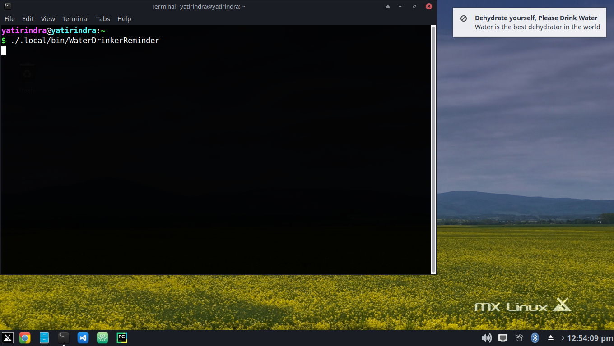

# Water-Drinker-Reminder

### Reminds to drink water in time

## Installation install_requires

* python3
* pip
* internet connection

## Installation

* Clone the code from github.
* Run the command <code>python3 setup.py sdist bdist_wheel</code>.
* Go into the dist directory.
* Install the wheel using the pip command.

## Image

